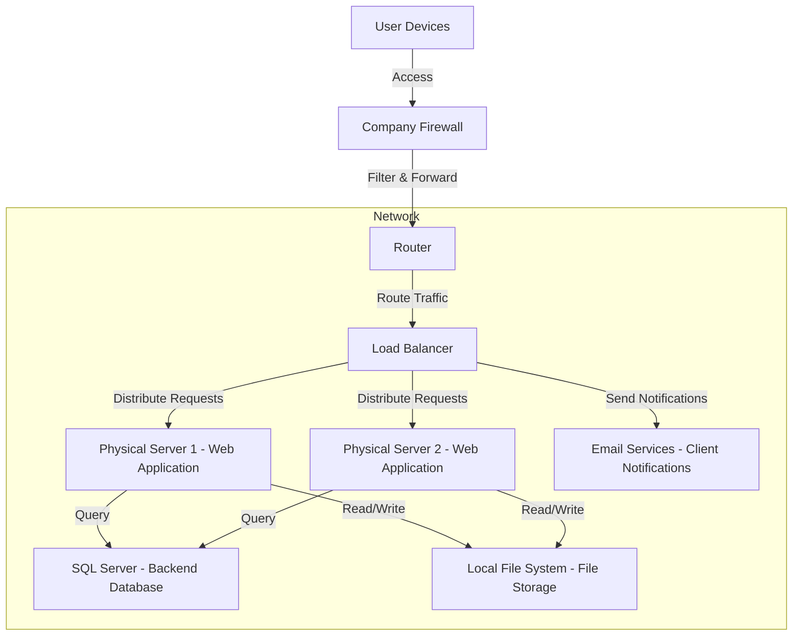
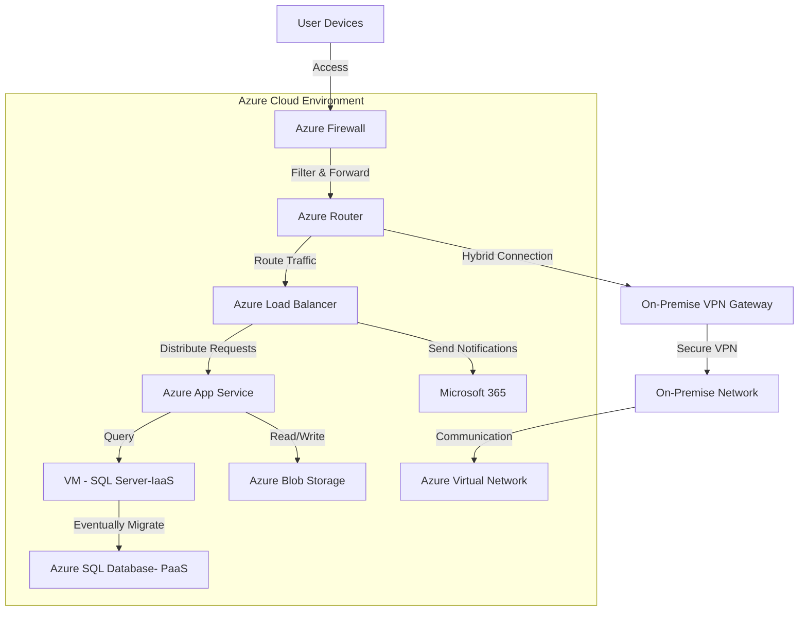

## Section 1: On Premise Solution
The given on-premise architecture is designed to support a mid-sized retail company, ensuring efficient user access to the web application.This architecture comprises of following components.
- **Web Application**: Monolithic, hosted on multiple physical servers [server1 and server2]
- **Backend Database**: SQL Server.
- **File Storage**: Local file system.
- **Networking**: Basic networking handled by company-operated routers and firewalls.
- **Email Services**: For client notifications.

<!-- On Premise architecture -->

                    Fig: On premise architecture

### Components of the On-Premises Architecture

1. **User Devices**:  
   These are the various devices through which users engage with the web application.

2. **Company Firewall**:  
   This is a security mechanism that oversees and regulates incoming and outgoing network traffics.

3. **Router**:  
   This device directs traffic from the firewall to the relevant components within the internal network, effectively managing data flow and ensuring that requests reach the destination services.

4. **Load Balancer**:  
   This balances the incoming requests between Physical Server 1 and Physical Server 2, and enhances responsiveness and boosts the availability of the web application.

5. **Physical Server 1 & Physical Server 2**:  
   These servers are responsible for hosting the web application, supplying the essential computational resources to handle the client's request.

6. **SQL Server**:  
   This is a relational database management system (RDBMS) designed to store structured data efficiently.

7. **Local File System**:  
   This refers to the storage solution utilized by the physical servers for managing various files.

8. **Email Services**:  
   This service is dedicated to email notifications to clients, keeping them informed about relevant updates and communications.

**To migrate this architecture to the cloud, the following shift can be considered:**

- **Web Application**: Migrate to either IaaS (Infrastructure as a Service) or PaaS (Platform as a Service).
- **SQL Database**: Migrate to a PaaS offering like Azure SQL Database or to IaaS as virtualized SQL servers.
- **File Storage**: Move to cloud file storage services like Azure Blob Storage (PaaS).
- **Networking**: Utilize cloud virtual networks and security services (IaaS).
- **Email Services**: Replace with a SaaS (Software as a Service) solution like Microsoft 365.

## Section 2: Proposed Migration Strategies
**Web application** - Migrate to Azure App Services [**PaaS**]

Migration of web application to PaaS providers like **Microsoft Azure App Service** is recommended as it supports multiple programming languages and offers built-in tools for CI/CD, scaling, and security features. Creation tools are often integrated into PaaS packages, facilitating quick application creation, testing, and deployment.

**SQL Database** - Migrate to Azure SQL Database [**IaaS & PaaS**]

Initially we can keep the SQL Server running in an IaaS environment at first to guarantee data consistency and reduce downtime.Later on, we can refactor to a PaaS database. Initially we start by provisioning a virtual machine with the required resources which allows us to have full control over the SQL Server environment.

Transition from an on-premises SQL Server to a fully managed PaaS offering- Azure SQL Database will have the benefits of managed service, scalibility, security, and high availability. Being a fully managed service, Azure SQL Database lowers administrative overhead by having Microsoft handle maintenance activities like upgrades, backups, and scaling. Built-in features like automatic backups and geo-replication ensure high availability and it also provides superior security measures, such as compliance with many regulatory standards and encryption both in transit and at rest.

**File Storage** - Migrate to Azure Blob Storage [**PaaS**]

Virtually infinite scalability is provided by PaaS cloud storage solutions, such as Azure Blob Storage. Data is automatically replicated across several data centers or geographical locations via cloud storage systems. For instance, **Azure Blob** Storage ensures data safety even in the event of a single region being offline by providing both geographic and local redundancy, or data replicated across many regions. Also, platforms like Azure provides extensive APIs and SDKs, making it easier to integrate file storage with the web application.

**Networking** [Routers and Firewalls] - Migrate to Azure Virtual Network [**IaaS**]

**Azure VNet** provides secure, isolated networks, with options for subnets, VPN, and integration with Azure services. Smooth and secure communication between Azure App Services, Azure SQL Database, and other Azure services is made possible by the seamless integration of Azure Virtual Network with these services. Also  we can monitor traffic, identify problems, and set up network security with tools like Azure Network Watcher. Businesses can safely expand their on-premises network to the cloud with cloud-native networking by using a VPN. A hybrid cloud architecture is created as a result.

On top of that, Monolithic application on premises architecture has high capital expenditure (CapEx), whereas cloud services works on Pay as you go model [OpEx]

**Email Services** - Migrate to Cloud Email Service- Microsoft 365 [**SaaS**]

On premise email services require setting up and maintaining email servers, cloud email service removes hassle of setting up and maintenance of email server. On premises server are comparatively less scalable than cloud servers. Through APIs or plugins, cloud service such as  Microsoft 365 make it simple to integrate with other cloud platforms, CRMs, and custom apps. Services like Microsoft 365 provide with advanced capabilities like email templates, scheduling, tracking, and automated workflows as basic features.

## Hybrid Migration Architecture

#### Hybrid architecture:
- **The Azure Firewall**, which provides improved security features and cloud-native capabilities for traffic monitoring and filtering, is now used in this architecture

- The **Azure Load Balancer** distributes incoming traffic to the Azure App Service.

- The database has transitioned to **Azure SQL Database**. Initially, it is hosted in an **IaaS** environment (VM-SQL server) for data consistency, eventually refactoring to a fully managed PaaS solution.

- Email services have been migrated to **Microsoft 365**, a SaaS solution that simplifies email management.

- Secure connection between the on-premise network and Azure services is now made possible by the architecture's inclusion of a Hybrid Connection employing an **On-Premise VPN Gateway**.

- The **Azure Virtual Network (VNet)** facilitates safe and segregated networking inside the Azure environment, hence facilitating seamless communication among all Azure services.

## Detailed Migration Plan

### 1. Web Application - Migrate to Azure App Services (PaaS)
#### 
**Strategy**: Rehosting (Lift and Shift)
- **Assessment and Analysis**: The very first step would be to analyze the current web application's architecture, programming languages, and dependencies.

- **Lift and Shift**: Begin to transfer the web application's fundamental functionality and architecture directly onto Azure App Services without affecting the application itself.

- **Configuration**: It is essential to use the built-in CI/CD pipeline tools in Azure to automate deployment processes.

- Set up **auto-scaling** features for the application.

- **Testing**: Conduct in depth performance and security testing in the Azure environment to check its efficiency.

### 2.SQL Database - Migrate to Azure SQL Database (IaaS -> PaaS)

**Strategy**: Phased Migration (IaaS First, Then Refactoring to PaaS)

*Phase 1 - IaaS (Lift and Shift)*:

- Provisioning: To host the current SQL Server as an IaaS, create an Azure Virtual Machine (VM) with the necessary compute and storage resources as per the need.

- Lift and shift: Reduce downtime and preserve data consistency by lifting and shifting the on-premises SQL database onto the Azure virtual machine.

- Data validation: This step makes sure that data migration is consistent and testing data integrity and performance in the IaaS environment.

*Phase 2 - PaaS (Refactoring)*:

- Refactoring: This step involves analyzing and refactoring the SQL Server to make it compatible with the fully working Azure SQL Database.
- Data Migration: Use **Azure Database Migration Service** to move data from the IaaS environment to the PaaS environment.
- Testing: Validating that data migration is completed is covered in this step.

### 3. File Storage - Migrate to Azure Blob Storage (PaaS)

Strategy: Rehosting (Lift and Shift)

- Data Classification and Assessment: First step is to find out the types of files stored in the current system and ensure compatibility with Azure Blob Storage and check if they are compatible.

- Data Transfer: Use *Azure Data Box or Azure Data Factory* to migrate large amounts of data from the current storage system to Azure Blob Storage, and this makes the process easy.
- Set Up Redundancy: Enable local or geo-redundant storage and this ensures high availability and disaster recovery.
- Integration: Next, we will refactor the web application to use Azure SDKs/APIs to access files directly from blob storage.
- Security: It is highly recommended to implement encryption for data at rest and in transit.

### 4. Hybrid Cloud Approach: Networking - Switch to Azure Virtual Network (IaaS) Strategy

- **Network Assessment:** This step includes examining the routers, firewalls, and topology of the on-premise network.

- **Configure Virtual Networks:** To provide safe connectivity across Azure resources, establish an Azure Virtual Network (VNet).

- **VPN Configuration:** It requires configuring a site-to-site VPN to create a hybrid connection between Azure and on-premises architecture.

- **Network Security Groups (NSG)** should be configured, and Azure Firewall should be employed to track traffic and safeguard the network.

- **Traffic Monitoring:** To keep an eye on traffic, solve issues, and uphold network security, we need to use *Azure Network Watcher*.

### 5. Email Services - Migrate to Microsoft 365 (SaaS)
Strategy: Rehosting and Refactoring
- Begin with reviewing mailboxes, policies, and workflows in the existing on-premise email system.
- **Tenant Setup:** This step requires to configure email services and set up a Microsoft 365 tenant.
- **Data migration:** To move email, contacts, and calendars to Microsoft 365, use of tools like the Microsoft 365 migration tool or outside providers is recommended.
- **Refactor** current integrations (such as CRMs or unique apps) to use APIs or plugins to link to Microsoft 365.
- **Employee training** is required for new Microsoft 365 capabilities including scheduling, tracking, and email templates.

The above mentioned migration strategy is made to minimize disruption and maximize performance, security, and scalability during the move to Azure's cloud-based architecture.

