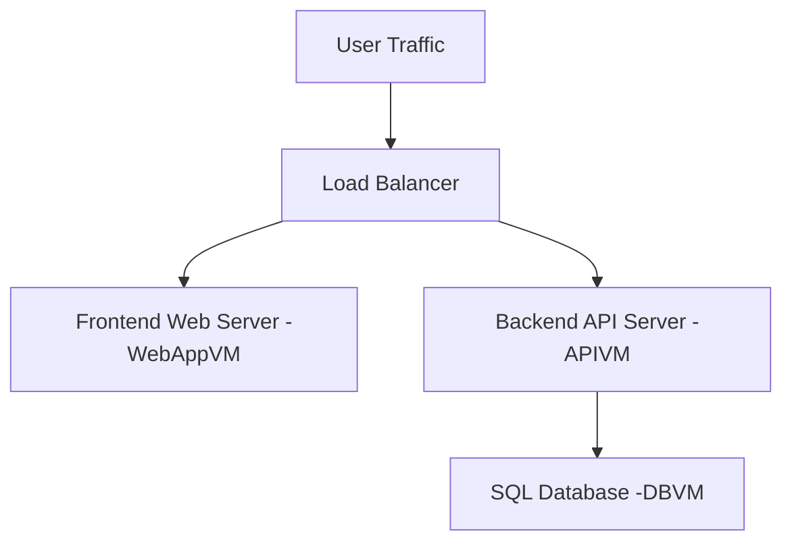
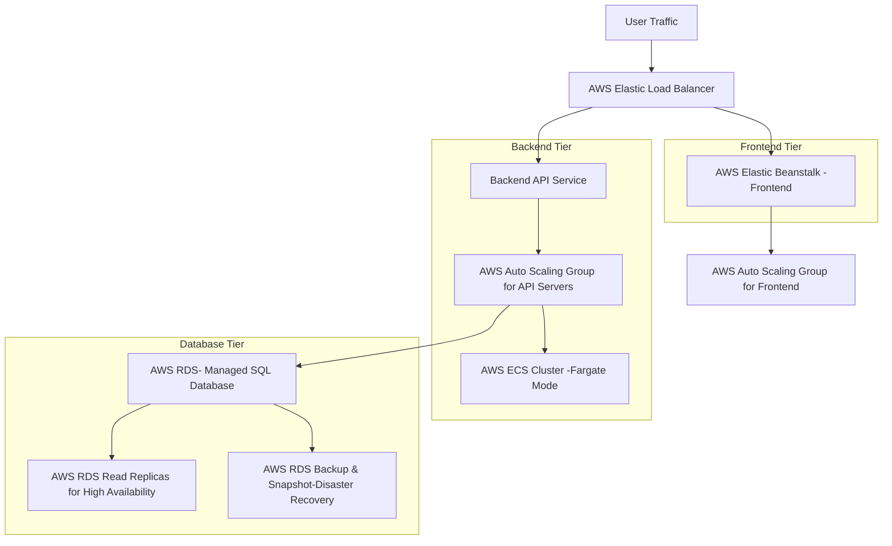

## Provided 3-tier Ecommerce application
As per the instruction on lab, we are provided with an application whose frontend web server is hosted on WebAppVM, which serves the user interface; a Backend API Server running on APIVM, which manages data processing and business logic; and a SQL Database hosted on DBVM, which stores and organizes data, make up this three-tier eCommerce application. The objective is to move the whole application to a cloud-native architecture [**AWS**], utilizing contemporary cloud services to increase scalability.

## High level diagram after migrated to AWS cloud services

**Frontend Tier**: Utilizing a **AWS Elastic Load Balancer** for traffic distribution, this tier is managed by **AWS Elastic Beanstalk**, which streamlines deployment and scalability.

**Backend Tier:** In order to provide more flexible hosting, the server applications are being moved to Amazon EC2. **AWS ECS (Fargate Mode)** will be used to manage containerized microservices, and an auto scaling group will make sure the application can handle a range of traffic loads.

**Database Tier:** The application moves to an **AWS RDS** managed SQL database, which provides options for data recovery through RDS Backup & Snapshot and guarantees high availability with Read Replicas.

## Component description
1. **User traffic:** It represents requests that users sending requests to the eCommerce application are making.
2. **Elastic load balancer:** It is responsible for distributing incoming traffic among several instances of frontend and backend services using Amazon Elastic Load Balancer.
3. **AWS Elastic Beanstalk:** A managed solution for front-end web application deployment and scaling.
4. **AWS Auto Scaling:** based on demand, automatically modifies the quantity of EC2 instances for both frontend and backend part.
5. Serverless container management is performed by **AWS ECS (Fargate Mode)** to operate the containerized backend API service.
6. Managed relational database service for SQL databases is provided by **AWS RDS.**
7. **AWS RDS Read Replicas** is responsible for assuring high avaialabilty the mechanism of replication of database.
8. **AWS RDS Backup & Snapshot** ensures automatic backup and disaster recovery for the application. 

## Scalability, Availability, and Disaster recovery Mechanism
**Scalability:** This cloud based architecture will be using an AWS Elastic Load Balancer to evenly spread user traffic across several instances of the frontend web server, which is hosted on **AWS Elastic Beanstalk.** This setup allows the system to scale up or down based on necessity during busy times like holidays or sales events. The backend, managed by **Auto Scaling Groups and AWS ECS (Fargate)**,are capable of adjusting to different traffic loads to keep API requests to ensure smooth running of application.

**Availability:**  The architecture uses **AWS RDS** for the SQL database to ensure high availability.Through the implementatiin of employing Read Replicas, it can balance the reading of data, which helps handle more customer requests at once even during the rush hours. On the other side, this process adds redundancy, which means if  one database goes down, another can take over, reducing the chances of downtime to less than 2 hours.

**Disaster Recovery using AWS RDS Automated Backups:**
The database instances are automatically backed up by **AWS RDS** once a day, and it keeps the backups for a time more than 35 days. Because the database can be immediately restored to a recent state, this becomes extremely helpful in the event of data corruption or inadvertent deletions (for example, if a faulty batch process runs and modifies product data).
Point-in-Time Recovery feature allows us to restore your RDS instance to any second within your backup retention period. It can be extremely useful to maintain quick reaction times during busy events like Black Friday or holiday sales.
And on top of that it is possible to configure AWS CloudWatch to track RDS performance and get notifications for any irregularities or problems that could point to future failures.

## Step-by-Step Migration Process

**Step 1: Pre-Migration Planning**
1. Understanding Current Architecture:

    It is initial and highly important step to review  existing architecture, including the Frontend Web Server (WebAppVM), Backend API Server (APIVM), and SQL Database (DBVM). Identify dependencies and configurations that needs to be migrated.
2. Setting Key goals: 

    Set specific goals for the move, including increased uptime, decreased latency, and improved scalability.
3. Choose a migration plan:
    A strategy tailored for the eCommerce website to minimize changes to the application while leveraging AWS services in the cloud envrionment.
4. 

